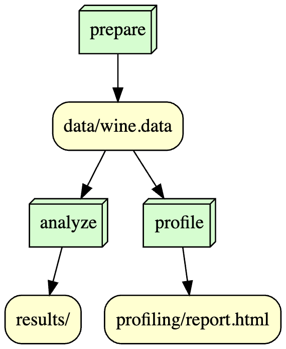

# IS477 Fall 2023 Final Project

## Overview
In this project, I analyzed the Wine Data Set from the UCI Machine Learning Repository to analyze and visualize the chemical composition of different types of wines. The Wine Data Set contains 178 instances of wine data with 13 attributes, such as alcohol, malic acid, ash, color intensity, hue, and proline. The attributes are derived from a chemical analysis of wines grown in the same region in Italy but derived from three different cultivars: Barolo, Grignolino, and Barbera. The goal is to classify the wines into one of the three cultivars based on their physicochemical properties.

## Analysis
The scatter plot illustrates the results of K-Means Clustering applied to Alcohol and Price. It shows three distinct clusters, each depicted in a different color. The clusters appear to be mainly differentiated by alcohol content. Additionally, there's a noticeable correlation between alcohol content and price: clusters with lower alcohol content generally have lower prices, while those with higher alcohol content tend to have higher prices. This implies that alcohol prices might be influenced by their alcohol content.

## Workflow
The workflow image below shows how we executed our analysis using Snakemake[^2^][2], a Python-based workflow management system. Snakemake automates the steps required to run our workflow from cloning our GitHub repository to generating our HTML report.

## Reproducing
Step 1: Clone the Repository
Clone the project repository to your local machine using the following command:

git clone https://github.com/hansikag/is477-fall2023-final-project.git

cd is477-fall2023-final-project

Step 2: Set Up Virtual Environment and Install Dependencies:

python -m venv venv
source venv/bin/activate

pip install -r requirements.txt

Step 3: Run prepare_data.py

python scripts/prepare_data.py

Step 4: Run profile.py

python scripts/profile.py

Step 5: Run analysis.py

python scripts/analysis.py

Optional: Use Docker
If you prefer Docker, you can use the Dockerfile provided in the repository to create an isolated environment.

docker build -t your-username/is477-fall2023:final-project .
docker run -it your-username/is477-fall2023:final-project
Remember to replace "your-username" with your actual Docker Hub username.

## License
This project is licensed under the MIT License[^3^][4], which allows you to use,
copy,
modify,
and distribute this software for any purpose,
as long as you include this notice and license terms.

## References
UCI Machine Learning Repository. (n.d.). Wine Data Set. Retrieved from https://archive.ics.uci.edu/ml/datasets/wine

Edotor. (n.d.). Retrieved from https://edotor.net/
